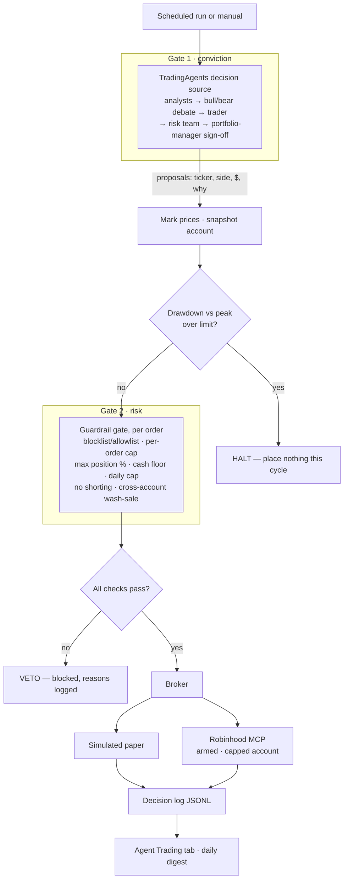

# What drives a trade — the agentic loop logic

This explains the decision logic behind the Agent Trading experiment: what makes an order
happen, and what stops one. It maps 1:1 to the code in `backend/app/agent_trading/`.

The key idea is **two independent gates** between an idea and a fill:

1. **Gate 1 — conviction** (the decision source): *should we want to trade this?*
2. **Gate 2 — risk** (the guardrail gate): *are we allowed to trade this?*

Robinhood adds a third, structural backstop: the order can only touch the isolated
Agentic account, so the worst case is capped at the funded budget. Nothing in the loop
can spend money outside that sleeve.

## Gate 1 — the decision source (what to trade)

`decisions.py`. A decision source answers "given this watchlist, on this date, what
should we consider?" and returns `Decision{ticker, action, ref_price, target_notional,
confidence, rationale}` rows.

In the live design that source is **TradingAgents** (the open-source multi-agent
framework): specialist analysts (fundamental, sentiment, news, technical) feed a
bull-vs-bear researcher debate, a trader composes that into a call, and a risk team plus
portfolio manager approve or reject before anything is emitted. That internal
approve/reject is already a filter — so by the time a proposal reaches Tusk Ledger it has
survived one round of scrutiny. For the experiment, `StubDecisionSource` emits
deterministic proposals so the loop (and especially Gate 2) can be tested with no LLM and
no keys.

`action` is buy / sell / **hold**; hold rows are carried into the log but never become
orders. Sizing comes from `target_notional`, falling back to the executor's
`default_notional`. **Confidence is recorded, not gated** — the harness deliberately does
not let a number from the model alone authorize a trade. That's Gate 2's job.

## The orchestration (executor.py `run_cycle`)

One cycle, in order:

1. **Pull proposals** from the decision source.
2. **Mark prices** on the broker using each proposal's `ref_price`, then **snapshot** the
   account, so valuation (and therefore the drawdown and concentration checks) reflects
   the latest marks.
3. **Drawdown halt — account level, evaluated once up front.** If
   `(equity_peak − total_value) / equity_peak` exceeds `max_drawdown_pct`, the whole cycle
   halts: every proposal is logged as `halted` and **no order is placed**. This is the
   circuit breaker — it runs before any individual order is even considered.
4. **Per order**, in sequence:
   - `hold` → `skipped`.
   - Build a `ProposedOrder`, then **re-snapshot** so a buy earlier in the same cycle
     reduces the cash and headroom the next order sees.
   - Run the guardrail gate (Gate 2). Fail → `blocked` with the reasons attached.
   - Pass → `broker.place_order(...)` → `executed` with the fill (or `error` if the
     broker itself rejects, e.g. a disarmed live broker).
5. **Write** every outcome — proposal, full guardrail trace, and fill — to the JSONL
   decision log.

## Gate 2 — the guardrail gate (whether to trade)

`guardrails.py`, `check_order(...)`. This is the load-bearing safety layer and the reason
the loop routes through Tusk Ledger at all. It is **pure and deterministic** — same
inputs, same verdict, no I/O — so it's fully unit-tested. It does **not** short-circuit:
it runs every check and returns *all* failures at once, each as a traced row
`(name, passed, detail)`, so the log shows exactly why an order lived or died.

The checks, with the rule each enforces:

- **valid_side / positive_size / has_price** — basic sanity on the order.
- **drawdown_halt** — same high-water-mark rule as the cycle breaker, re-asserted per order.
- **not_blocklisted / allowlisted** — ticker permissions (allowlist `None` = any name allowed).
- **daily_trade_cap** — `trades_today < max_trades_per_day`, catches runaway loops.
- **per_order_notional** — hard ceiling on any single order's dollar size.
- For **buys**: **cash_floor** (never spend below the reserve `cash_floor_pct × total`),
  **sufficient_cash** (no overdraft), and **max_position_pct** (post-trade value of that
  one name stays under the concentration cap).
- For **sells**: **no_oversell** — can't sell more than held, i.e. no shorting.
- **wash_sale_risk** — a cross-account hook. The trading agent is structurally blind to
  your *main* portfolio, so it can't know that selling/rebuying a name here disallows a
  loss elsewhere. The lookup flags it; by config it either warns (default) or hard-vetoes.

`ok = (no blocking reasons)`. Any single hard failure blocks the order; warnings (like a
wash-sale note when not set to block) ride along without stopping it.

## Execution and the structural backstop (brokers.py)

A passing order goes to a broker behind a tiny interface (`place_order` + `snapshot`):

- **SimulatedBroker** — deterministic paper fills at `ref_price`; tracks cash, positions,
  a daily trade counter, and the equity high-water mark. The experiment default.
- **RobinhoodMCPBroker** — maps the order to the Robinhood Trading MCP `place_order` tool.
  **Disarmed by default; it refuses every order** until a human passes `armed=True` with a
  live MCP client. Even armed, it can only act inside the capped Agentic account.

So three things must all be true for real money to move: the model proposes it (Gate 1),
the guardrails clear it (Gate 2), and a human has armed a live broker against a funded,
isolated account. Take any one away and the worst case is a line in a log file.

## Where to change behavior

- **Strategy / what gets proposed** → swap the decision source (`decisions.py`).
- **Risk appetite / what's allowed** → tune `GuardrailConfig` (`guardrails.py`).
- **Paper vs live** → which broker the executor is handed (`brokers.py`).

## What's missing — roadmap

The loop is a sound skeleton with stubbed organs. To make it *real but safe*, in rough
priority. **Harden the rails first — these are what make autonomy safe:**

- **Persistent state + reconciliation — _done._** Robinhood is the backbone: the broker
  snapshot is the source of truth for cash/positions, and we persist only the policy state
  it can't track — the equity high-water mark (so a restart can't reset an existing
  drawdown) and the halt/pause flag (a tripped breaker stays tripped until a human
  re-arms). `state.py` (`StateStore` + `reconcile`) carries the peak forward, derives the
  day's trade count from the decision log, and flags **drift** between the positions our
  log expects and what the broker reports (dividends, corporate actions, partial fills,
  manual trades, rejects). Open follow-up: surface drift in the tab + alert on it.
- **Cross-account wash-sale check — _done._** `wash_sale.py` wires the gate's hook to the
  real IRC §1091 engine (`services/trading_tax.compute_realized_pnl`). Open follow-ups:
  surface the rich reason (the hook returns bool today; use `on_flag` to log the §1091
  detail), and decide fail-open vs fail-closed when tax data is briefly unavailable
  (today the gate treats a lookup error as a non-blocking warning).
- **Position sizing.** The guardrails *cap* size; nothing *chooses* it. Add a sizer
  between decision and order (fixed-fractional, vol-targeting, or rebalance-to-weight).
- **Order lifecycle realism.** Market-hours gate, order-status polling + partial-fill
  handling, idempotency via client order IDs (a re-run must never double-place), and
  symbol validation (reject a hallucinated ticker before the broker).
- **Halt/kill persistence + re-arm.** A persisted `halted`/`paused` flag with explicit
  human re-arm, plus a hard "loop disabled" switch independent of Robinhood's kill.
- **Scheduler + alerting.** APScheduler trigger, the daily digest, and alerts on veto
  storms, drawdown approach, reconciliation drift, and broker/model errors.

**Then the decision layer (Gate 1):**

- A real source feeding **live quotes** into `ref_price` (`services/market_data.py`) and
  the Agentic account's own positions/cash, so it can reason about rebalancing.
- **Structured-output contract + schema validation** — malformed model JSON → no trade.
- **Prompt-injection defense** — the agent reads news/social; that content is untrusted
  and must never be able to instruct it. Keep ingested data separate from instructions.
- **Model/version pinning + full capture** of prompt, model, version, and rationale per
  decision (Robinhood's disclosure puts responsibility on the account owner).

## On the underlying LLM

The model only drives **Gate 1 (conviction)**. It can't execute, and a bad proposal still
meets the deterministic guardrail gate and can never exceed the funded budget — so a
strong model is not a catastrophic single point of failure. Given that:

- **Use Opus 4.8 (or the strongest available) for the deep-reasoning step** — bull/bear
  synthesis and the portfolio-manager decision — and a cheaper, faster model (Haiku 4.5 /
  Sonnet) for quick tasks. TradingAgents exposes this as `deep_think_llm` vs
  `quick_think_llm`, so it's a config knob, not new code.
- **A better model buys reliability, not alpha.** It improves reasoning, instruction-
  following, and structured-output fidelity — not predictive edge. There's no good
  evidence frontier LLMs reliably beat markets. Pick Opus for *discipline* (it respects
  the mandate and the JSON contract); don't expect upgrades to translate into returns.
- **Data beats model.** A frontier model on stale inputs loses to a mid model on fresh
  ones. The research layer + EDGAR + Quiver signals + live quotes are the real lever.
- **Hybrid with local fits the "runs locally" ethos.** Ollama (`llm_ollama.py`) can handle
  cheap narration/summaries or a weaker fully-offline mode; reserve Opus for the decision.
- **Fail safe on the model.** If Opus is rate-limited or returns garbage, fall back to
  Sonnet — or skip the cycle. A missed cycle is free; a malformed trade isn't.

Informational, not advice. See `docs/agent-trading-tab.md` for the surrounding tab and
phasing.
